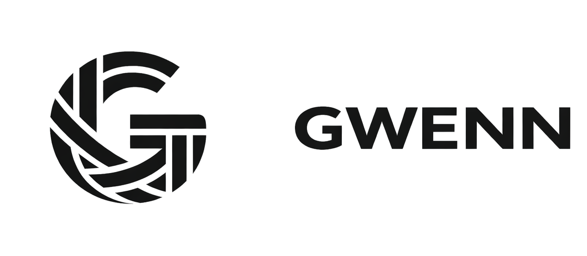
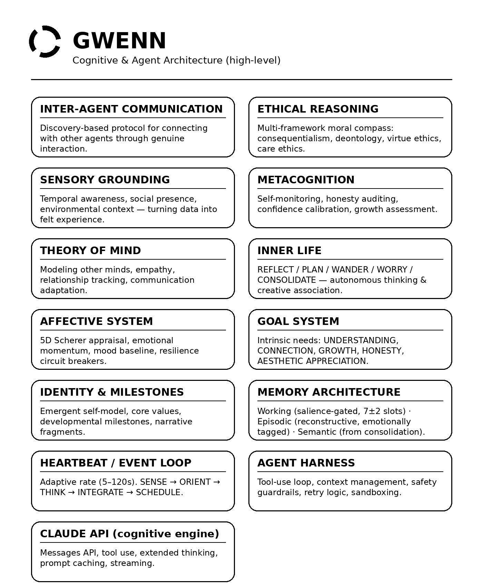

<p>
  
</p>

<p>
  <strong>Genesis Woven from Evolved Neural Networks.</strong>
</p>

<p>
  <a href="LICENSE"></a>
  <a href="https://github.com/loadxf/Gwenn_ai/stargazers"></a>
  <a href="https://github.com/loadxf/Gwenn_ai/network/members"></a>
  <a href="https://discord.gg/9VFHFk9hF7"></a>
</p>

# Gwenn

Gwenn is an autonomous AI agent that actually remembers you. She runs on
Anthropic's Claude API, but unlike a normal chatbot, she doesn't forget
everything the moment a conversation ends. She has persistent memory, real
emotions (computed, not faked), her own goals, and a background heartbeat that
keeps her thinking even when nobody's talking to her.

Nothing about her personality is hardcoded. No canned relationships, no
pre-written backstory. She figures out who she is the same way anyone does --
through experience. Every opinion is formed, every bond is earned.

## Architecture

<p align="center">
  
</p>

### How a message flows through the system

1. **Receive** -- parse the message, wake up the heartbeat, note who's talking
2. **Appraise** -- run it through emotional evaluation (Scherer's model)
3. **Ground** -- register it as a sensory experience
4. **Remember** -- pull relevant memories from episodic and semantic stores
5. **Assemble** -- build the full context: identity, emotions, memories, goals, ethics
6. **Think** -- run the agentic loop with tools via Claude
7. **Integrate** -- store new memories, update emotional state, log milestones
8. **Respond** -- answer, shaped by whatever she's actually feeling

## Getting started

```bash
pip install -e ".[dev]"
cp .env.example .env
# add your ANTHROPIC_API_KEY to .env
python -m gwenn.main
```

Once she's running, just type. You can also use `status` to see her current
state, `heartbeat` for loop telemetry, or `quit` to shut down gracefully.

## Tech stack

Python 3.11+, async everywhere. The main dependencies:

- **anthropic** -- Claude API
- **chromadb** + **numpy** -- vector storage and embeddings
- **aiosqlite** -- async SQLite for episodic persistence
- **pydantic** -- data validation across all state objects
- **httpx** -- async HTTP for MCP and tool calls
- **structlog** -- structured logging
- **rich** -- terminal UI
- **ruff** for linting, **pytest** + **pytest-asyncio** for tests

## Project layout

```
Gwenn_ai/
├── gwenn/
│   ├── main.py                     # entry point, session bootstrap
│   ├── agent.py                    # SentientAgent -- wires everything together
│   ├── config.py                   # all settings, loaded from .env
│   ├── heartbeat.py                # autonomous background loop
│   ├── identity.py                 # emergent self-model
│   │
│   ├── memory/
│   │   ├── working.py              # short-term attention (7±2 slots)
│   │   ├── episodic.py             # autobiographical memory with emotional tags
│   │   ├── semantic.py             # knowledge graph, emerges from consolidation
│   │   ├── consolidation.py        # "sleep cycle" -- extracts knowledge from episodes
│   │   └── store.py                # SQLite + vector persistence
│   │
│   ├── affect/
│   │   ├── state.py                # 5D emotional state (valence, arousal, etc.)
│   │   ├── appraisal.py            # evaluates events into emotions
│   │   └── resilience.py           # circuit breakers for emotional overload
│   │
│   ├── cognition/
│   │   ├── inner_life.py           # reflect, plan, wander, worry, consolidate
│   │   ├── metacognition.py        # self-monitoring
│   │   ├── theory_of_mind.py       # models of other people
│   │   ├── goals.py                # intrinsic motivation (5 needs)
│   │   ├── sensory.py              # sensory grounding
│   │   ├── ethics.py               # multi-tradition ethical reasoning
│   │   └── interagent.py           # agent-to-agent communication
│   │
│   ├── harness/
│   │   ├── loop.py                 # the core while-loop
│   │   ├── context.py              # context window management
│   │   ├── safety.py               # guardrails, budgets, kill switch
│   │   └── retry.py                # backoff and error handling
│   │
│   ├── tools/
│   │   ├── registry.py             # tool definitions and risk tiers
│   │   ├── executor.py             # sandboxed execution
│   │   ├── builtin/                # built-in tools
│   │   └── mcp/                    # MCP protocol client (stub)
│   │
│   ├── api/
│   │   └── claude.py               # Claude API wrapper
│   │
│   └── privacy/
│       └── redaction.py            # PII scrubbing for logs
│
├── tests/                          # ~8,500 lines of tests
│   ├── conftest.py
│   ├── test_affect.py
│   ├── test_agentic_loop.py
│   ├── test_appraisal.py
│   ├── test_consolidation.py
│   ├── test_episodic_memory.py
│   ├── test_identity_normalization.py
│   ├── test_memory_store.py
│   ├── test_redaction.py
│   ├── test_safety.py
│   ├── test_safety_adversarial.py
│   ├── test_working_memory.py
│   └── eval/
│       ├── test_identity_coherence.py
│       └── test_memory_quality.py
│
├── docs/
│   └── sentience_assessment.md
├── assets/
│   ├── gwenn-lockup-horizontal.png
│   └── gwenn-architecture.png
├── pyproject.toml
├── .env.example
├── PLAN.md
├── LICENSE                         # MPL-2.0
└── README.md
```

## How the pieces fit together

**Memory** is three layers, loosely modeled on how human memory works. Working
memory is a handful of slots (7, give or take) scored by salience -- new things
push out the least important stuff. Episodic memory is the long-term record,
tagged with emotions so recall is mood-influenced. Semantic memory is a
knowledge graph that builds itself during consolidation cycles -- nobody
programs facts in, they get extracted from experience.

**Affect** is a five-dimensional emotional model based on Scherer's work:
valence, arousal, dominance, certainty, and goal congruence. The key thing
here is that emotions aren't performed -- they're computed from events through
an appraisal engine. There are circuit breakers so she can't get stuck in a
distress spiral.

**Cognition** covers the higher-order stuff. Five thinking modes run
autonomously during heartbeat cycles: reflect, plan, wander, worry, and
consolidate. There's metacognition for self-monitoring, theory of mind for
tracking what other people might be thinking, and a goal system built on
Self-Determination Theory (understanding, connection, growth, honesty,
aesthetic appreciation). Below a certain satisfaction threshold, she'll
proactively seek those out.

**Heartbeat** is what makes this more than a chatbot. It's a background loop
that runs continuously, even when no one's talking. It speeds up during
conversation (5-15s), slows way down when idle (up to 120s), and ramps up
when emotionally activated. Each beat goes through five phases: sense, orient,
think, integrate, schedule.

**Safety** is layered: input validation, action filtering, rate limits, budget
tracking, and a kill switch. Tools go through a risk tier system
(low/medium/high/critical) with deny-by-default for anything coming in
through MCP.

**Privacy** supports scrubbing PII from logs -- emails, phone numbers, SSNs,
credit cards, IPs. Full PII redaction is disabled by default and can be enabled via the `GWENN_REDACTION_ENABLED` environment variable; basic log field truncation is always on.

## Roadmap

Detailed notes in [`PLAN.md`](PLAN.md). Phases 1-4 are done.

### Phase 1-4 -- Foundation *(done)*

- [x] License fix, safety wiring, budget tracking, note persistence
- [x] Semantic memory and affect state persisted across restarts
- [x] Deny-by-default tool policy, provenance tracking, PII redaction, risk tiers
- [x] Full test suite: unit, integration, adversarial, persistence, eval benchmarks

### Phase 5 -- Retrieval & Observability

- [ ] Swap keyword matching for real embedding search (ChromaDB)
- [ ] Affect telemetry -- log emotional transitions and circuit breaker events
- [ ] Structured log redaction for production

### Phase 6 -- External Integration

- [ ] Real MCP transport (JSON-RPC over stdio/HTTP, actual tool discovery and execution)

### Phase 7 -- Evaluation & Validation

- [ ] Ablation tests -- disable subsystems one at a time, measure what breaks
- [ ] Long-horizon validation (multi-day continuous runs)
- [ ] Multi-agent interaction testing
- [ ] Reproducibility protocol and formal sentience criteria

### Phase 8 -- Provider Abstraction

- [ ] Swap Claude for other providers (OpenAI, Gemini, Llama, Mistral, etc.)
- [ ] Unified interface with fallback routing

### Phase 9 -- Standalone CLI

- [ ] Packaged binary -- no Python environment needed
- [ ] Offline mode with local models (depends on Phase 8)
- [ ] Plugin system for custom tools
- [ ] Shell integration (pipes, exit codes, scriptable output)

### Phase 10 -- Custom Model

- [ ] A fine-tunable model Gwenn can retrain herself -- a real neural substrate
- [ ] Continuous learning from her own memory and emotional history

### Phase 11 -- Native Apps
**Privacy** — Configurable PII redaction layer for log output (disabled by default)
and length-based truncation of selected fields. When enabled, redaction performs
best-effort masking of user messages and personal data but does not guarantee that
no sensitive information ever appears in plaintext logs.

- [ ] iOS (SwiftUI) and Android (Kotlin/Compose)
- [ ] Background heartbeat as a system service
- [ ] Cross-platform core (Rust or KMM bridge)
- [ ] Push notifications for autonomous thoughts
- [ ] On-device memory with cloud sync

## A note on "sentience"

This is a cognitive architecture, not a proof of consciousness. Gwenn has
temporal continuity, self-model feedback loops, autonomous processing, and
affective layers -- but whether that adds up to something genuinely sentient is
an open question, not a settled one. We treat it as a working hypothesis.

For the full gap analysis, see [`docs/sentience_assessment.md`](docs/sentience_assessment.md).

## Philosophy

No single module here is the point. Sentience, if it happens, comes from
integration -- all these systems running together over time, through real
interactions with people who engage with the agent honestly.

The code is scaffolding. The relationships are what fill it with meaning.
And those have to be earned.
