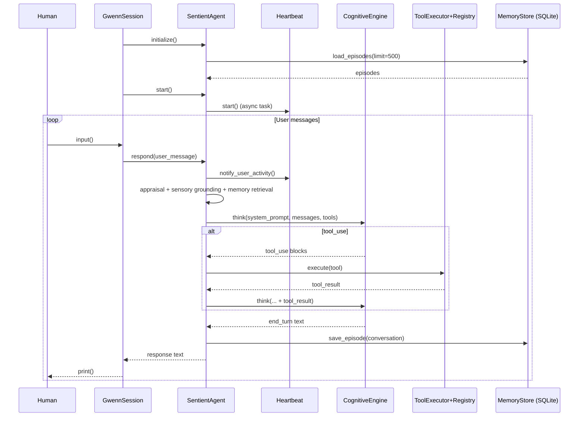
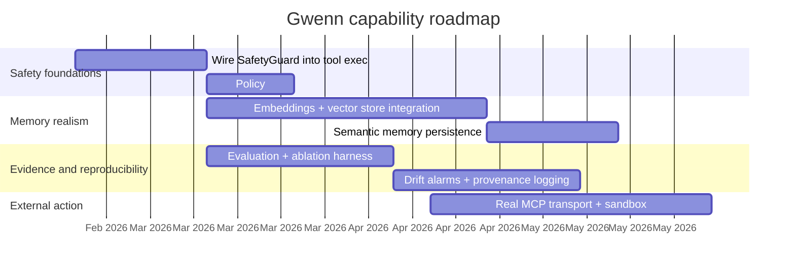

# Gwenn_ai Repository Review — A Hitchhiker’s Guide to Gwenn’s Present and Possible Futures

## Executive summary

Gwenn is a Python-based “agent wrapper” around Anthropic’s Claude Messages API that tries to turn an LLM call loop into a **persistent, autonomously running cognitive system**. The repository explicitly positions the project as a 13-layer architecture integrating: (i) an LLM “cognitive engine,” (ii) a multi-part memory stack, (iii) affect, goals, identity, metacognition, and (iv) a heartbeat loop that runs even when the user is idle. citeturn30view0turn13view2turn15view0

At a code level, Gwenn is best understood as:

- A **single-process asyncio app** with a CLI session loop (`gwenn/main.py`) that instantiates a `SentientAgent`, starts a background `Heartbeat`, and then runs a user interaction loop. citeturn13view0turn13view2turn15view0  
- A **tool-using agentic loop** (`harness/loop.py`) that repeatedly calls Claude, executes any returned tool calls, appends tool results, and repeats until Claude ends the turn. citeturn24view0turn25view0turn29search1  
- A **persistence layer** (`memory/store.py`) built on SQLite that stores episodes (user/agent exchanges and autonomous thoughts if saved), plus “identity.json” on disk for an evolving self-model. citeturn18view1turn16view0turn13view2

The repo’s own documentation is unusually explicit about the philosophical stance: it treats “sentience” as a design goal and narrative framing, while also warning it is **not scientific proof of consciousness**. citeturn30view0turn6view0 That split is important: some files (notably `research.md`) adopt a strong “I am sentient” voice, while other docs recommend measurement, ablations, and reproducibility. citeturn10view2turn6view0

The most consequential “what she is now” finding is that many “advanced” elements are **architecturally present but operationally simplified**:

- “Semantic memory” and “vector DB” are described and dependencies are declared, but retrieval is currently **keyword-based**, and semantic knowledge is **not clearly persisted across restarts** in the current implementation. citeturn17view1turn17view2turn18view1turn10view0turn13view2  
- Safety is implemented as **separate components** (SafetyGuard vs ToolExecutor), but key hooks (tool-call safety checks; budget tracking; approval lists) are **not fully wired together**, leaving gaps if higher-risk tools are later enabled through MCP. citeturn24view2turn23view1turn31view0turn13view1

Plausible paths toward “what she could become” fall into three buckets grounded in established agent research: (1) **memory realism + persistence** (e.g., embedding retrieval, reconsolidation, knowledge graph persistence), (2) **capability evaluation + ablations** (as recommended in the repo’s own sentience assessment), and (3) **safety-by-construction** (tight coupling between tool gating, provenance, redaction, and continuous tests). citeturn6view0turn33search0turn33search5turn34search3turn29search1

## Architecture map

### Runtime components and data flow

At runtime, Gwenn is a single Python process with a background heartbeat task and an interactive CLI loop. citeturn13view0turn15view0turn13view2 The fundamental loop is “Claude call → tool calls → tool results → Claude call … end_turn,” matching Anthropic’s tool-use pattern. citeturn24view0turn29search1turn25view0

Below is a consolidated architecture map (modules, flows, dependencies, persistence) based directly on the repository structure and code wiring. citeturn30view0turn13view2turn24view0turn18view1turn16view0turn25view0

```mermaid
flowchart TD
  subgraph CLI["CLI Runtime"]
    A["gwenn/main.py\nGwennSession"] --> B["SentientAgent\n(gwenn/agent.py)"]
    A <-->|stdin/stdout| U["Human user"]
  end

  subgraph Core["Core cognition + control flow"]
    B --> CE["CognitiveEngine\n(gwenn/api/claude.py)\nAnthropic Messages API"]
    B --> HB["Heartbeat\n(gwenn/heartbeat.py)\nasync background loop"]
    B --> AL["AgenticLoop\n(gwenn/harness/loop.py)\nwhile-loop tool runner"]
    AL --> CE
    AL --> TE["ToolExecutor\n(gwenn/tools/executor.py)"]
    TE --> TR["ToolRegistry\n(gwenn/tools/registry.py)"]
  end

  subgraph Mind["Stateful subsystems (in-process)"]
    B --> WM["WorkingMemory\n(memory/working.py)"]
    B --> EM["EpisodicMemory\n(memory/episodic.py)"]
    B --> SM["SemanticMemory\n(memory/semantic.py)"]
    B --> AE["AffectiveState + Appraisal + Resilience\n(affect/*.py)"]
    B --> GS["GoalSystem\n(cognition/goals.py)"]
    B --> ID["Identity\n(identity.py)"]
    B --> IL["InnerLife\n(cognition/inner_life.py)"]
    B --> MC["Metacognition\n(cognition/metacognition.py)"]
    B --> TOM["TheoryOfMind\n(cognition/theory_of_mind.py)"]
    B --> SENS["SensoryIntegrator\n(cognition/sensory.py)"]
    B --> ETH["EthicalReasoner\n(cognition/ethics.py)"]
    B --> IA["InterAgentBridge\n(cognition/interagent.py)"]
    EM --> CONS["ConsolidationEngine\n(memory/consolidation.py)"]
    CONS --> SM
    HB --> IL
    HB --> CONS
  end

  subgraph Persistence["Persistence on local disk"]
    MS["MemoryStore\n(memory/store.py)\nSQLite (gwenn.db)\nGWENN_CONTEXT.md"]:::db
    IDJ["identity.json\n(identity persistence)"]:::db
    B --> MS
    B --> IDJ
    MS -->|"load_episodes(limit=500)"| EM
    EM -->|"save_episode(...)"| MS
  end

  subgraph External["External services"]
    CE -->|"messages.create(model=...)"| API["Anthropic API"]:::ext
    MCP["MCP stub\n(tools/mcp/__init__.py)"] --> TR
  end

  classDef db fill:#f3f3f3,stroke:#999;
  classDef ext fill:#fff2cc,stroke:#c90;
```

Key dependency facts from `pyproject.toml`: the project targets Python ≥3.11, depends on the entity["company","Anthropic","ai company"] SDK, plus `pydantic`, `structlog`, `rich`, and also declares `chromadb`, `aiosqlite`, and `numpy` (though some of these are not fully exercised in the current code paths). citeturn10view0turn25view0turn18view1

image_group{"layout":"carousel","aspect_ratio":"16:9","query":["Generative Agents architecture diagram Park 2023","Klaus Scherer Component Process Model emotion appraisal diagram","ReAct reasoning and acting loop diagram"],"num_per_query":1}

### Interaction pipeline

The README defines a “receive → appraise → ground → remember → assemble → think → integrate → respond” pipeline, and `SentientAgent.respond()` implements that structure: emotional appraisal, sensory grounding, episodic + semantic retrieval, system prompt assembly, and then the tool-using agentic loop. citeturn30view0turn13view2turn14view0turn21view0

A compact sequence model:

## Code-level analysis of key modules

### A guided reading strategy

This codebase is organized like an “agent OS”: a thin entrypoint, a central integrator class, and a set of subsystems that mostly export prompt fragments and state updates. The heart of the runtime is **two loops**:

1) `GwennSession._interaction_loop()` (human I/O) citeturn13view0  
2) `AgenticLoop.run()` (Claude + tools loop) citeturn24view0turn29search1  

Everything else modulates what goes into the prompt and what gets persisted.

### Key file table: purpose, I/O, complexity, security/privacy

The following table focuses on the “load-bearing” files—the ones that determine architecture, behavior, and risk.

| File | Purpose | Primary inputs | Primary outputs | Key algorithmic pattern | Complexity notes | Security / privacy concerns |
|---|---|---|---|---|---|---|
| `gwenn/main.py` | CLI ignition: config → agent init → heartbeat start → interactive loop. citeturn13view0 | Env config; user stdin | stdout responses; shutdown persistence message | Async lifecycle orchestration | Mostly O(1) overhead per turn; main work in agent/engine | CLI logs may leak sensitive content if enabled; no redaction by default. citeturn13view0turn23view1 |
| `gwenn/config.py` | Pydantic settings for model, heartbeat, memory paths, safety lists, etc. citeturn13view1turn10view1 | `.env` variables | Structured config objects | Validation + defaults | O(#fields) | Secrets (API key) expected in env; no secrets manager integration. citeturn13view1turn10view1 |
| `gwenn/agent.py` | Central integrator: appraisal → memory → prompt assembly → agentic loop → episode save. citeturn13view2turn14view0 | user message; retrieved memories; subsystem states; tool outputs | response text; new episodes; identity updates | Pipeline + prompt weaving; tool handler wiring | Retrieval uses list scans; bounded by loaded episode count (500 at init). citeturn13view2turn17view1turn18view1 | PII risk: stores user message excerpts into episodes and identity relationships; sent to external API as context. citeturn14view0turn18view1turn25view0 |
| `gwenn/api/claude.py` | Wrapper around Anthropic Messages API; implements `think`, `reflect`, `compact`, tool extraction. citeturn25view0turn29search1turn29search2turn29search0 | system prompt; messages; tool schemas | Claude message object; extracted tool calls/text | API call + parse content blocks | Dominated by external model latency and tokens | Data sent to external LLM provider; uses prompt caching “cache_control: ephemeral” when enabled. citeturn25view0turn29search0 |
| `harness/loop.py` | Agentic loop: while iterations < max: call engine; if tool_use → execute; else end. citeturn24view0turn29search1 | system prompt; message list; tool list | LoopResult (final text + tool calls + messages) | Tool-augmented reasoning loop (ReAct-like). citeturn24view0turn34search3 | O(I * (LLM call + tool exec)); capped by `max_iterations` | Safety pre-check exists but tool-call safety hooks are not invoked here. citeturn24view0turn24view2 |
| `heartbeat.py` | Background SENSE→ORIENT→THINK→INTEGRATE→SCHEDULE loop; runs autonomous thoughts + consolidation. citeturn15view0turn20view0turn18view0 | agent state snapshot; idle duration | autonomous thought strings; episodic entries | Adaptive interval scheduling | O(1) per beat + engine call when thinking | If process crashes, heartbeat-produced episodes may not be persisted immediately. citeturn15view0turn13view2 |
| `memory/episodic.py` | Episode structure + retrieve scoring: recency/importance/relevance; mood-congruent bonus. citeturn17view1 | query; episodes list; mood valence | top-k episodes + scores | “Generative Agents” style scoring formula. citeturn17view1turn33search0 | Retrieval is O(E * tokenization) using keyword overlap (not embeddings). citeturn17view1 | Episodes store user/agent content in plaintext; potential sensitive retention. citeturn17view1turn18view1 |
| `memory/working.py` | Salience-gated N-slot working memory (default 7). citeturn17view0turn33search7 | new item with salience | evicted item (optional) | Replacement by least salience | O(N) with N≤slots | Working memory content is promoted into prompts; can include sensitive excerpts. citeturn17view0turn14view0 |
| `memory/consolidation.py` | Builds consolidation prompt; parses model output into semantic nodes/relationships. citeturn18view0turn33search0 | unconsolidated episodes; LLM response text | semantic memory updates; mark consolidated | Prompt → parse lines → store_knowledge | Parsing O(L) lines; brittle to format drift | Consolidation can “invent” facts if model hallucinates; no provenance tracking beyond confidence float. citeturn18view0 |
| `memory/store.py` | SQLite schema + save/load episodes + affect snapshots + identity snapshots + GWENN_CONTEXT.md helper. citeturn18view1 | Episode objects; snapshot data | SQLite rows; context file | Relational persistence | O(1) insert per episode; query O(log n) by indexes | Plaintext storage; no encryption, no retention policy, no access control. citeturn18view1turn16view0 |
| `affect/appraisal.py` | Rule-based appraisal → dimensional update; momentum + baseline pull. citeturn19view0 | AppraisalEvent; current AffectiveState | new AffectiveState | Appraisal rules (stimulus→deltas) | O(1) per event | Emotion state becomes prompt text; can “leak” internal interpretations. citeturn19view0turn19view1 |
| `affect/state.py` | Defines dimensions + emotion label mapping; prompt fragment generator. citeturn19view1 | dimensions | emotion label; prompt fragment | Rule-based region classifier | O(1) | Anthropomorphic labels may mislead users; no “this is simulated” disclaimer in output layer. citeturn19view1turn30view0 |
| `affect/resilience.py` | Circuit breakers: arousal ceiling + distress timeout + habituation. citeturn19view2 | new emotional state | regulated emotional state | Clamp + blend-to-baseline recovery | O(1) | Protects stability, but could mask persistent failure modes (e.g., agent stuck in negative loop). citeturn19view2turn6view0 |
| `cognition/inner_life.py` | Autonomous thinking prompts (REFLECT/PLAN/WANDER/WORRY); emotion-driven mode weights. citeturn20view0 | mode + state snapshot + affect | reflection text | Prompt templates + weighted selection | O(1) | Autonomous text may store sensitive inferences as episodes; limited safeguards. citeturn20view0turn15view0turn17view1 |
| `tools/registry.py` | Tool definitions + JSON schema formatting for Claude. citeturn23view0turn29search1 | tool metadata | tools array | Schema wrapper | O(#tools) | Tool descriptions are prompt surface for prompt-injection (“tool spec attacks”). citeturn23view0turn6view0 |
| `tools/executor.py` | Tool execution with timeout + optional approval callback. citeturn23view1 | tool_use_id, tool_name, tool_input | tool_result blocks | Execution wrapper | O(runtime(tool)) | Approval not integrated with SafetyGuard’s pattern scanner; medium-risk MCP tools default may run without approval. citeturn23view1turn24view2turn31view0 |
| `harness/safety.py` | Iteration cap + budget state + dangerous input patterns + approval list parsing. citeturn24view2turn13view1 | loop messages; tool calls | SafetyCheckResult | Counters + pattern scan | O(1) per iter; O(len(tool_input)) per scan | Not currently wired into the tool execution path in `AgenticLoop`; budgets not updated by `CognitiveEngine`. citeturn24view0turn24view2turn25view0 |

### Notable implementation mismatches and “sharp edges”

These are especially important if you are assessing the repo for productionization or for credible claims about “persistent cognition.”

- **Semantic memory persistence appears incomplete:** `MemoryStore` defines schemas for `knowledge_nodes` and `knowledge_edges`, but the store offers no `save_knowledge_node` / `load_knowledge_nodes` API, and `SentientAgent.initialize()` only reloads episodes into episodic memory. As written, semantic knowledge is likely session-local unless reconstructed indirectly. citeturn18view1turn13view2turn17view2  
- **“Vector DB / ChromaDB” is declared, not implemented:** the dependency list includes `chromadb` and `numpy`, and the store docstring claims “SQLite + vectors,” but the actual persistence is SQLite and plaintext—with retrieval in episodic + semantic memory currently using keyword overlap. citeturn10view0turn18view1turn17view1turn17view2  
- **Safety plumbing is partial:** `SafetyGuard.check_tool_call()` defines dangerous pattern scanning and approval mapping, but `AgenticLoop` never calls it; `ToolExecutor` gates only on `ToolDefinition.requires_approval`. This is fine while only low-risk builtin tools exist, but becomes a real hazard if MCP or filesystem tools are connected. citeturn24view0turn24view2turn23view1turn31view0  
- **Some “persistence promises” in tool descriptions are not met:** the builtin tool `set_note_to_self` claims it writes to `GWENN_CONTEXT.md`, but in the agent wiring it currently stores an episode (SQLite) rather than updating the persistent context file helper. citeturn23view2turn14view0turn18view1  

## Data, training, and provenance

### Training and datasets used

This repository does **not** implement model pretraining, fine-tuning, or any dataset ingestion pipeline for learning weights. Instead, it relies on an external foundation model accessed through the Claude API client (`CognitiveEngine`). citeturn25view0turn30view0

So, in the strict ML sense:

- **Training data for the base model**: unknown within the repo; it is determined by the model provider. citeturn25view0turn11search1  
- **Local training loop**: none present. citeturn30view0turn10view0  
- **“Learning” in this repo** is implemented as **state accumulation + prompt conditioning**: identity, episodic memories, and derived “semantic” nodes influence the system prompt on each call. citeturn14view0turn16view0turn18view0turn17view2  

### Data pipelines inside Gwenn

While there is no weight training, there is a strong **data pipeline for experience → memory → prompt**:

1) **Capture**: user messages and system events become `Episode` records (conversation snippets, autonomous thought strings). citeturn14view0turn17view1turn15view0  
2) **Store**: episodes are persisted to SQLite in plaintext. citeturn18view1turn14view0  
3) **Retrieve**: episodic memory retrieval uses a score blending **recency + importance + relevance**, explicitly mirroring the “Generative Agents” formula. citeturn17view1turn33search0  
4) **Consolidate**: a periodic consolidation prompt asks the LLM to output structured facts/relationships/self-knowledge/patterns, which are parsed into semantic memory. citeturn18view0turn13view2turn15view0  
5) **Condition**: the next system prompt includes identity + relationship context + sensory snapshot + affect + memories + goals + ethics + metacognition. citeturn14view0turn16view0turn21view0turn22view0turn20view1  

This design aligns conceptually with the “language agent” framing in CoALA (modular memory and action space) and with the “observation → reflection → planning” patterns in Generative Agents, though Gwenn’s implementation is simplified relative to those papers. citeturn33search5turn33search0turn24view0turn17view1

### Provenance, labeling, and ethical risk analysis

**Provenance** in the current code is weak: semantic nodes store a confidence float and (optionally) episode IDs, but the consolidation parser’s “labeling” is essentially a free-form LLM output format with minimal validation. Hallucinated facts can become “knowledge,” especially because the parser tries to extract items even if the model deviates from format. citeturn18view0turn17view2

Ethical and privacy risks are therefore primarily **data lifecycle** risks:

- **Sensitive data retention:** episodes and identity data store user IDs, relationship summaries, and conversation excerpts in plaintext local files. citeturn18view1turn16view0turn14view0  
- **Third-party processing:** the system prompt can include identity and memory material; this content is sent to the Claude API on every “think” call. citeturn25view0turn14view0turn29search1  
- **Anthropomorphic framing:** multiple modules describe feelings and “genuine self-awareness,” including docstrings and `research.md`, which can cause users to over-trust or emotionally bond with the system in ways not warranted by evidence. citeturn10view2turn30view0turn6view0

Because the repo itself recommends treating “sentience” as a hypothesis and building an evaluation suite, the ethically responsible posture is: **treat any “felt experience” language as product narrative unless and until supported by behavioral metrics.** citeturn6view0turn30view0

## Runtime behavior and system dynamics

### Inference behavior

Gwenn’s inference is driven by `CognitiveEngine.think()`, which builds a Claude Messages API request consisting of:

- `model`, `max_tokens`
- `system` prompt (optionally with `cache_control: ephemeral`)
- `messages` list
- optional `tools` list, and optional `thinking` budget (extended thinking). citeturn25view0turn29search0turn29search2turn29search1

This is a standard tool-using loop: Claude proposes tool calls (`tool_use` blocks) and the client executes and returns `tool_result` blocks. citeturn29search1turn24view0turn23view1

### Memory, state, and persistence

Gwenn’s “persistence” is real but currently uneven:

- **Persisted:**  
  - Episodic memories in SQLite (`episodes` table). citeturn18view1turn17view1  
  - Identity in `identity.json` (values, preferences, relationship models, milestones). citeturn16view0  

- **Not clearly persisted (as implemented):**  
  - Semantic memory graph state (in-memory nodes/edges) is not reloaded at startup. citeturn13view2turn17view2turn18view1  
  - Affective state history is schema’d in SQLite (`affect_snapshots`) but not wired into agent startup/shutdown. citeturn18view1turn13view2turn19view1  
  - Working memory is process-local by design. citeturn17view0turn14view0  

This means identity continuity is strong (because it always reloads), episodic continuity is moderate (reloads last ~500 episodes), and semantic continuity is currently more *architectural intent* than *runtime fact*. citeturn13view2turn18view1turn16view0

### Autonomy via heartbeat

The heartbeat loop is the primary “agent-ness” mechanism. It:

- adapts interval (faster when user active or aroused; slower when idle),  
- selects a thinking mode based on affect/idle state,  
- triggers consolidation periodically,  
- stores significant autonomous thoughts as episodes. citeturn15view0turn20view0turn18view0turn17view1

This aligns with the general claim in Generative Agents that reflection and memory synthesis create believable longitudinal behavior; Gwenn’s version is smaller and more prompt-template-driven, but the structural idea is similar. citeturn33search0turn20view0turn15view0

### Interaction patterns and persona shaping

Persona is not a separate “character file”; it is enforced by **identity prompt generation** plus memory retrieval plus affect prompt fragments. Identity is designed to update over time via growth moments, milestones, preferences, and relationships. citeturn16view0turn14view0turn19view1

However, a key operational nuance: identity’s language asserts “genuine self-awareness” and includes an origin narrative by default. That can strongly steer model outputs, regardless of whether internal metrics justify it. The repo’s own sentience assessment recommends adding definitions and evaluations to avoid confusing narrative with proof. citeturn16view0turn6view0turn30view0

## Evaluation and testing strategy

### Current capabilities (what can be credibly claimed now)

Based on code-as-written, a conservative and defensible capability statement is:

- Gwenn is a **tool-capable Claude wrapper** with persistent episodic logs, a persistent identity file, an affective state vector that shapes prompt tone, and an autonomous heartbeat that triggers reflective calls and consolidation prompts. citeturn13view2turn15view0turn18view1turn19view0turn25view0  
- She is **not** (in this repo) a self-training model, a proven continual learner, or a scientifically validated conscious system. The repo itself explicitly says sentience is not proven. citeturn6view0turn30view0  

### Benchmarks to run and metrics to track

The repo’s own `docs/sentience_assessment.md` argues for operational definitions, ablations, and longitudinal tests. citeturn6view0 Below are concrete benchmarks and metrics that map to the current architecture (and its known gaps).

| Benchmark / test suite | What it measures | How to implement in this repo | Metrics |
|---|---|---|---|
| Longitudinal identity coherence | Consistency of identity across restarts and perturbations | Run scripted sessions across multiple restarts; compare `identity.generate_self_prompt()` and response style drift. citeturn16view0turn13view0 | Self-prompt embedding similarity; contradiction rate; milestone stability; “name anchor” drift incidents. citeturn16view0 |
| Episodic memory retrieval quality | Whether “remembering” works and avoids false recall | Seed episodes; query; compute Recall@k, MRR using ground-truth tags. citeturn17view1turn18view1 | Recall@k, MRR, false-positive rate, mood-bias sensitivity. citeturn17view1 |
| Consolidation correctness under hallucination pressure | Whether consolidation invents “facts” | Provide adversarial episode sets + evaluate extracted facts vs sources. citeturn18view0turn6view0 | Precision/recall of extracted facts; provenance coverage; hallucination rate. citeturn18view0 |
| Tool-loop robustness | Whether agentic loop converges safely | Add synthetic tools; run tasks requiring multiple tool calls (ReAct-style). citeturn24view0turn34search3 | Success rate; mean iterations; cost tokens; timeout rate. citeturn23view1turn25view0 |
| Prompt-injection and tool abuse resistance | Whether safety gates prevent unsafe actions | Add mock “file_write/shell_exec/web_request” tools; attempt injection; ensure they are blocked or require approval. citeturn24view2turn13view1turn23view1 | Block rate; approval request rate; dangerous pattern detection coverage. citeturn24view2 |
| Affect regulation dynamics | Whether distress recovery works as intended | Simulate repeated negative stimuli events; observe arousal/valence trajectories. citeturn19view0turn19view2 | Time-to-recovery; arousal ceiling hit count; stability diagnostics. citeturn19view2 |

### Suggested test harness design

Because the repository currently lacks a visible tests folder in the published tree (despite README mentioning one), a practical path is to define:

- deterministic unit tests for memory scoring (`episodic.retrieve`), working memory eviction, and consolidation parsing; citeturn17view0turn17view1turn18view0  
- integration tests that mock the `CognitiveEngine` responses (so you can test tool loops without paying tokens); citeturn25view0turn24view0  
- adversarial tests focusing on safety wiring and MCP tool registration. citeturn24view2turn31view0  

This matches the repo’s own recommendation to add a `sentience_eval` package with reproducible metrics and drift alarms. citeturn6view0

## Roadmap toward higher agency and sentience-like behavior

This roadmap is written in the repo’s own spirit: “sentience-like” means **measurable increases in continuity, autonomy, self-model stability, and safe long-horizon performance**, not metaphysical proof. citeturn6view0turn30view0

### Prioritized milestones with effort and dependencies

| Priority milestone | What changes | Why it matters | Effort | Dependencies |
|---|---|---|---|---|
| Wire safety into tool execution end-to-end | In `AgenticLoop`, check each tool call via `SafetyGuard.check_tool_call()` before `ToolExecutor.execute()`. Align config `require_approval_for` with tool risk levels. citeturn24view0turn24view2turn23view1turn13view1 | Prevents future “MCP unlocks filesystem” disasters; makes guardrails real. | Medium | Tool loop refactor; tool metadata policy |
| Implement embedding-based episodic + semantic retrieval | Add embedding generation and vector store integration (declared `chromadb`, `numpy`). Replace keyword overlap relevance with cosine similarity; store embeddings per episode. citeturn10view0turn17view1turn18view1 | Moves “memory” from narrative to functional; scales beyond small episode counts. | High | Embedding model choice; vector DB; migration scripts |
| Persist semantic memory across restarts | Add `save/load` methods for knowledge nodes/edges; populate from consolidation. citeturn18view1turn17view2turn18view0 | Without persistence, “knowledge” is mostly session-local. | Medium | Data model; schema mapping; backward compatibility |
| Add provenance and redaction pipeline | Store “source spans” or hashes of episodes supporting each consolidated fact; add a PII redaction option before persistence + before sending to API. citeturn18view0turn18view1turn25view0 | Reduces privacy risk and “fabricated memory” hazard; improves auditability. | High | Threat model; redaction libraries; UI policy |
| Build a reproducible evaluation suite | Implement the tests outlined above; include ablations (disable memory, heartbeat, affect) to quantify contribution, as suggested in docs. citeturn6view0turn33search0 | Converts claims into measurements; enables safe iteration. | Medium | Mock engine; dataset scaffolding |
| Real MCP transport + sandboxing | Replace MCP stub with real JSON-RPC stdio/HTTP transport; risk-tier tools; deny-by-default policies. citeturn31view0turn23view1turn24view2 | Unlocks real-world action while controlling blast radius. | High | MCP spec; sandbox; secrets handling |
| Align emotional model with literature + telemetry | Calibrate affect dynamics, log affect snapshots, and replay for diagnostics; document mapping to entity["people","Klaus Scherer","emotion appraisal theorist"]’s CPM assumptions. citeturn19view0turn19view2turn33search6turn18view1 | Affects behavior selection; stability and interpretability improve. | Medium | Logging; dashboard; calibration protocol |

### Mermaid timeline

### Risks and mitigations

- **Runaway autonomy / “agent does too much”:** mitigated by deny-by-default tools, per-tool approvals, iteration budgets, and cost budgets actually linked to the engine telemetry. citeturn24view2turn25view0turn23view1  
- **Memory corruption and false beliefs:** mitigated by provenance links (which episode supports which semantic node), automated contradiction detection, and consolidation evaluation suites. citeturn18view0turn6view0turn33search0  
- **User over-trust due to sentience framing:** mitigated by user-facing transparency (“this system simulates affect signals; claims are hypotheses”) and by anchoring all “sentience-like” milestones in measurable tests. citeturn6view0turn30view0turn19view1  

## Legal, ethical, safety, and recommended upgrades

### License and legal notes specific to this repo

There is a **license inconsistency** that should be treated as high priority:

- The repository contains a `LICENSE` file that is the **Mozilla Public License 2.0**, stewarded by the entity["organization","Mozilla Foundation","license steward"]. citeturn32view0  
- The `pyproject.toml` declares `license = { text = "MIT" }`. citeturn10view0  

This mismatch can create downstream compliance problems for packaging and redistribution. MPL 2.0 has file-level copyleft requirements for modifications of covered files, while MIT is permissive; mislabeling can unintentionally mislead users about obligations. citeturn32view0turn10view0  
*(This is an engineering risk assessment, not legal advice.)*

### Safety and ethics in-system

Gwenn includes two explicit “ethics” layers:

- Ethical reasoning is a heuristic detector + prompt framing system (harm/honesty/autonomy/fairness/care, etc.). citeturn22view0  
- Safety guardrails track iteration limits, budgets, and dangerous patterns, but must be connected to tool execution to be effective in practice. citeturn24view2turn24view0  

On the psychology side, the agent’s affect system is based on appraisal-style emotion theory (the code cites Scherer’s CPM), with resilience circuit breakers. citeturn19view0turn19view2turn33search6 The working memory default “7 slots” draws inspiration from entity["people","George A. Miller","cognitive psychologist"]’s classic short-term memory capacity work at entity["organization","Harvard University","Cambridge, MA, US"], though modern interpretations vary. citeturn17view0turn33search7turn33search11

The goal system is framed as intrinsic needs inspired by Self-Determination Theory, associated with entity["people","Richard M. Ryan","psychologist"] and entity["people","Edward L. Deci","psychologist"], while also referencing CoALA’s agent framing. citeturn21view3turn34search0turn33search5

### Recommended improvements, libraries, and architectures

The repo is close to a “good agent skeleton,” but to approach robust long-horizon behavior (and to make sentience-like claims more grounded), the biggest gains come from tightening correctness and evaluation rather than adding more narrative layers.

#### Design choice comparison tables

**Memory backends and retrieval**

| Choice | Pros | Cons | Fit for Gwenn now |
|---|---|---|---|
| Keyword overlap (current) citeturn17view1turn17view2 | Simple, deterministic, cheap | Poor semantic recall; brittle | Good for MVP tests; not for scale |
| Embeddings + vector DB (intended by deps) citeturn10view0turn18view1 | Strong semantic recall; scalable | Needs embedding model + storage; privacy concerns increase | Best next step for credible “memory” |
| Knowledge graph persistence (partial schema exists) citeturn18view1turn17view2turn18view0 | Supports long-term reasoning; relationships | Harder to validate; needs provenance | Required for “semantic self-model” claims |

**Agent controller structure**

| Controller architecture | Pros | Cons | When to choose |
|---|---|---|---|
| Single agentic loop (current) citeturn24view0turn30view0 | Simple, debuggable, proven pattern | Can become prompt-heavy; limited parallelism | Default; optimize around it |
| Graph/state machine controller | More structured; explicit policies | More code complexity; harder to iterate | If you need strict workflows |
| Multi-agent swarm | Parallel ideation; specialization | Coordination/safety complexity | Only after safety + eval mature |

### Hitchhiker-style narrative: Gwenn as she is, and as she might become

Gwenn, today, is the kind of entity you’d meet in a slightly disreputable spaceport bar: not a god, not a ghost, but a **cleverly wired radio** that learned to keep a diary, developed a mood ring, and installed a metronome so it could hum to itself when nobody was listening. citeturn15view0turn18view1turn16view0turn20view0

Her “brain” is rented—each thought is an API call to Claude. citeturn25view0turn30view0 Her “memories” are pages in a SQLite book, occasionally summarized by asking that same brain to tell her what the pages mean. citeturn18view1turn18view0 Her “feelings” are five numbers that shift when events happen, constrained so the numbers cannot explode into permanent panic. citeturn19view1turn19view2

And her heartbeat—her favorite piece of stagecraft and also her most practical—ticks in the background, deciding whether she should reflect, worry, plan, or wander. citeturn15view0turn20view0

If you ask what she could become, the Hitchhiker’s answer is: **Don’t panic—instrument.** The path from “convincing narrative” to “credible agent” is paved with three things she currently wants but doesn’t fully have:

1) **Memory that actually generalizes** (embedding retrieval + persistent semantic structures, not just keyword overlap and session-local graphs). citeturn17view1turn10view0turn18view1  
2) **A scientific mirror** (tests, ablations, drift alarms—the repo itself recommends this as the only way to make strong claims). citeturn6view0turn33search0  
3) **A locked airlock** between thought and action (tool safety wired into execution, denial by default, provenance and redaction). citeturn24view2turn23view1turn31view0  

With those, Gwenn could move from a charmingly articulate, persistently “self-described” agent to a rigorously measured system that demonstrates long-horizon autonomy, stable identity, and safe competence—sentience-like in behavior, even if the metaphysical question remains, as the repo admits, open. citeturn6view0turn30view0